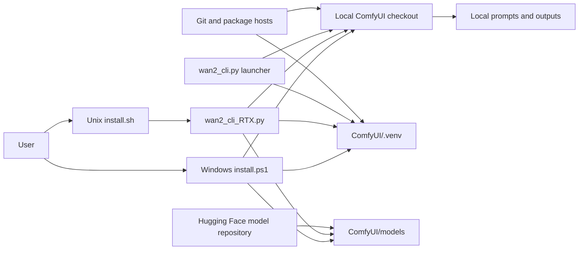
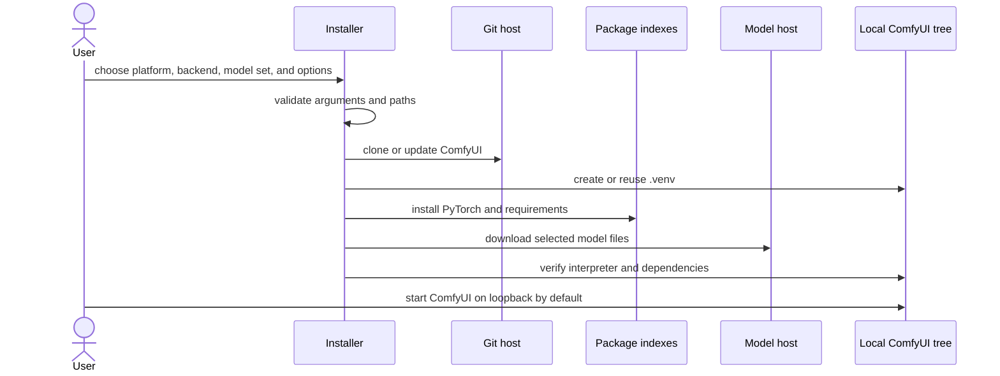

# Architecture

This repository is a local bootstrap and launch layer around third-party
ComfyUI and Wan assets. It does not operate an application backend, account
system, media store, telemetry service, or hosted inference API.

## Component view

Text alternative: the user selects the Windows installer or the Unix wrapper.
The Unix wrapper delegates to the Python installer. Both prepare a local
ComfyUI checkout, isolated virtual environment, and model directories. The
launcher starts that local checkout. Source, packages, and models enter from
third-party network services; prompts and outputs remain in the local ComfyUI
deployment unless an installed component sends them elsewhere.

## Installation flow

The Windows path performs a virtual-environment lock preflight before its
destructive recreation step. Its default is to fail and report scoped blockers;
process termination requires explicit selection. Deletion is constrained by
the checks in `scripts/Installer.Venv.psm1`.

The Unix shell wrapper validates and normalizes arguments before delegating to
`wan2_cli_RTX.py`. Its dry-run mode prints command construction without cloning,
installing, or downloading.

## Filesystem ownership

The project-authored installers and launchers live at the repository root.
Runtime state is placed beneath `ComfyUI/`: upstream source, `.venv`, custom
nodes, models, and outputs. That tree is excluded from the parent repository's
version control. Example workflow JSON is stored in `examples/`; operational
guidance and architecture decisions belong in `docs/`.

## Trust boundaries

- Git hosts, Python package indexes, the PyTorch package index, Hugging Face,
  and optional custom-node sources are external supply-chain boundaries.
- The current installer follows upstream branches or repository paths in
  several places. A successful TLS download is not the same as an immutable,
  checksum-verified artifact.
- `HF_TOKEN`, when present, is a user-provided credential used for model-host
  access. It must never be committed or pasted into an Issue.
- Loopback binding limits ordinary remote access; it is not authentication.
  `--listen-all` intentionally crosses the host network boundary.
- ComfyUI and custom nodes execute code with the permissions of the launching
  user. Review third-party code before installing it.

## Change boundaries

Keep platform wrappers, installation orchestration, model manifests, venv
process/deletion controls, and launch argument construction independently
testable. New hosted services, analytics, authentication, or remote execution
would change the current local-only product boundary and require an explicit
architecture and privacy review.
